# Práctica 2.2 – Autenticación en Nginx
## Paquetes necesarios
Comprobamos  si el paquete está instalado
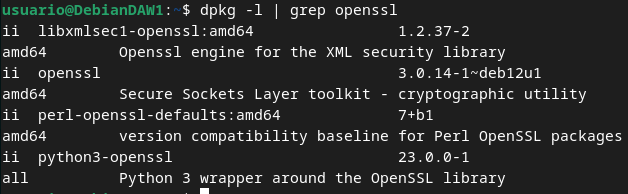
## Creación de usuarios y contraseñas para el acceso web
Crearemos un archivo oculto llamado “.htpasswd” en el directorio de configuración /etc/nginx donde guardar nuestros usuarios y contraseñas
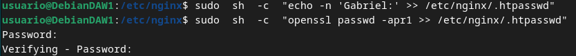

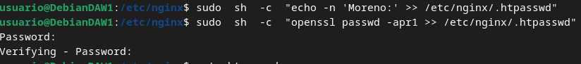
Comprobamos que el usuario y la contraseña aparecen cifrados en el fichero
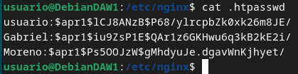

## Configurando el servidor Nginx para usar autenticación básica
Utilizaremos la directiva ``auth_basic`` dentro del location y le pondremos el nombre a nuestro dominio que será mostrado al usuario al solicitar las credenciales. Por último, configuramos Nginx para que utilice el fichero que previamente hemos creado con la directiva ``auth_basic_user_file`` 
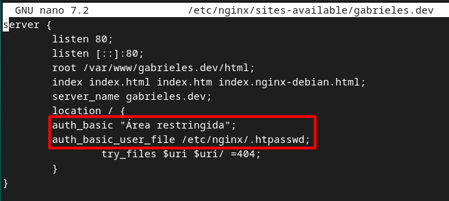

### Probando la nueva configuración

Comprobamos desde la máquina física que podemos acceder al sitio web y que se te solicita autenticación
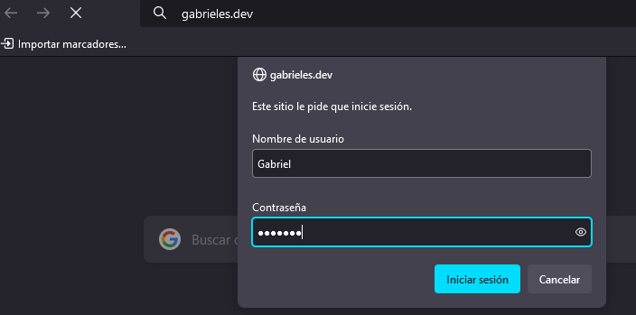


En caso de fallar el usuario/contraseña saldrá el siguiente error: 
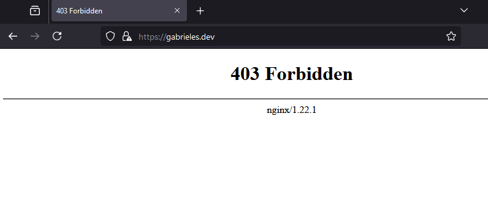

Si queremos acceder a un nuevo location debajo con la autenticación básica para el archivo/sección contact.html únicamente
usamos añadimos la siguiente configuración:

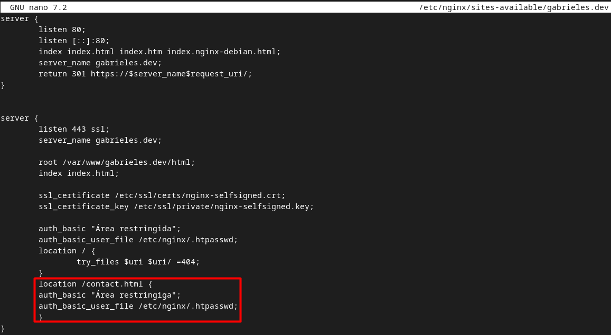

Y podemos comprobar como pide la autenticación: 
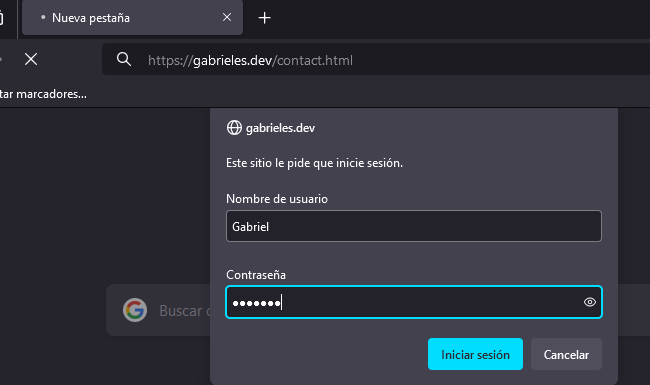
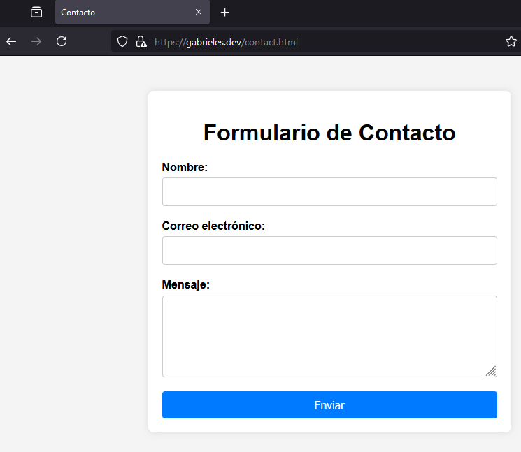

## Combinación de la autenticación básica con la restricción de acceso por IP

Cómo permitir o bloquear el acceso a una IP específica (directivas ``allow`` y ``deny``, respectivamente). Dentro del bloque del servidor o en el archivo de configuración del dominio web, que, como recordatorio, está ubicado en el directorio sites-available:


``deny all`` indica que, por defecto, se denegará el acceso a todos. Por ello, es crucial colocar las reglas más específicas de allow y deny justo antes de esta, ya que se evaluarán en el orden en que están. Si se colocaran después, se bloquearía el acceso a todos, dado que deny all sería evaluado primero.

``satisfy all`` se utiliza para permitir el uso cambiando de una ip valida (con allow o deny) y ademas ser un usuario valido. si una de las dos validaciones no es correcta el usuario no puede acceder a la web.

``satisfy any`` mientras el usuario o la ip sean validas el usuario podrá acceder a la web

En el ejemplo se deniega el acceso a la ip 192.16.0.20
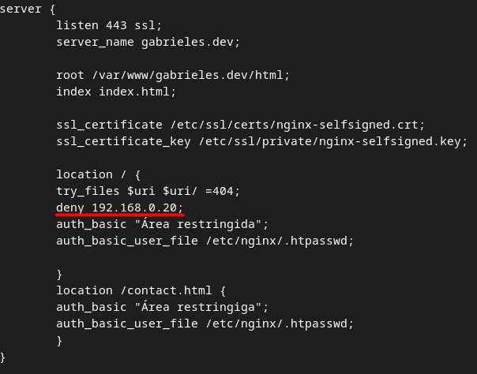


## Cuestiones

### Cuestión 1
Supongamos que yo soy el cliente con la IP 172.1.10.15 e intento acceder al directorio web_muy_guay de mi sitio web, equivocándome al poner el usuario y contraseña. ¿Podré acceder?¿Por qué?

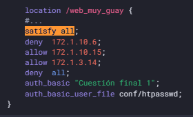
#### Solución
El usuario no podra acceder a la web. Tiene una IP permitida dentro de la configuracion, pero necesita tener tanto una IP valida como autentificarse correctamente. esto debido a la presencia de satisfy all;

### Cuestión 2
ask "Cuestión 1" Supongamos que yo soy el cliente con la IP 172.1.10.15 e intento acceder al directorio web_muy_guay de mi sitio web, introduciendo correctamente usuari y contraseña. ¿Podré acceder?¿Por qué?

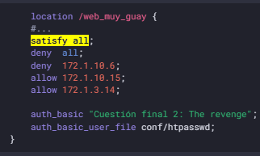
#### Solución
Sí, se podrá acceder a la web pues se utiliza una IP admitida y una autentificación correcta.
### Cuestión 3
Supongamos que yo soy el cliente con la IP 172.1.10.15 e intento acceder al directorio web_muy_guay de mi sitio web, introduciendo correctamente usuario y contraseña. ¿Podré acceder?¿Por qué?

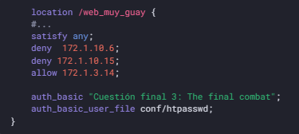
#### Solución
Podrá acceder. dado que la presencia de satisfy any indica que teniendo una ip valida o introduciendo unas credenciales correctas podemos acceder a la web
### Cuestión 4

A lo mejor no sabéis que tengo una web para documentar todas mis excursiones espaciales con Jeff, es esta: Jeff Bezos y yo. Supongamos que quiero restringir el acceso al directorio de proyectos porque es muy secreto, eso quiere decir añadir autenticación básica a la URL:Proyectos. Completa la configuración para conseguirlo:

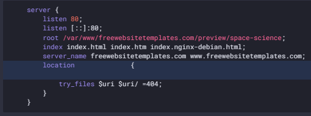

#### Solución
```
server {
    listen 80;
    listen [::]:80;
    root /var/www/freewebsitetemplates.com/preview/space-science;
    index index.html index.htm index.nginx-debian.html;
    server_name freewebsitetemplates.com www.freewebsitetemplates.com;

    location / {
        try_files $uri $uri/ =404;
    }

    location /Proyectos/ {
        auth_basic "Restricted Area";
        auth_basic_user_file /etc/nginx/.htpasswd;
        try_files $uri $uri/ =404;
    }
}
```