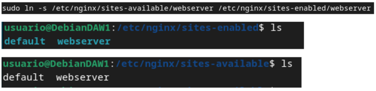

# Práctica 2.3 – Proxy inverso con Nginx

## Nginx servidor web
Vamos a configurar dos Debian con sendos servidores Nginx. Tenéis la máquina virtual inicial y debéis clonarla para tener una segunda:

 - Uno servirá las páginas web que ya hemos configurado, así pues utilizaremos el servidor que ya tenemos configurado de la Práctica 2.1.

- El nuevo servidor clon Debian con Nginx configurado como proxy inverso

- Realizaremos las peticiones HTTP desde el navegador web de nuestra máquina física/anfitrión hacia el proxy clonado, que nos redirigirá al servidor web original

En primer lugar, debéis cambiar el nombre que tuviera vuestra web por el de webserver, ello implica:

- Cambiar el nombre del archivo de configuración de sitios disponibles par Nginx

- Cambiar el nombre del sitio web dentro de este archivo de configuración donde haga falta

- En el archivo de configuración del sitio web, en lugar de hacer que el servidor escuche en el puerto 80, cambiadlo al 8080.

- No os olvidéis de eliminar el link simbólico antiguo con el comando unlink nombre_del_link dentro de la carpeta sites-enabled y crear el nuevo para el nuevo nombre de archivo.

## Nginx proxy inverso
Ahora, cuando intentamos acceder a http://ejemplo-proxy (o el nombre que tuvieráis de vuestra web de las prácticas anteriores), en realidad estaremos accediendo al proxy, que nos redirigirá a http://webserver:8080, el servidor web que acabamos de configurar para que escuche con ese nombre en el puerto 8080.

Para ello:

- Crear un archivo de configuración en sites-available con el nombre ejemplo-proxy (o el que tuvieráis vosotros)

- Este archivo de configuración será más simple, tendrá la siguiente forma

## Comprobaciones

- Comprobad  la petición y respuesta con las herramientas de desarrollador de Firefox

## Añadiendo cabeceras

Para añadir cabeceras, en el archivo de configuración del sitio web debemos añadir dentro del bloque ``location / { … }`` debemos añadir la directiva: 
``add_header Host nombre_del_host;``

Comprobamos que podemos acceder al sitio web sin problemas

