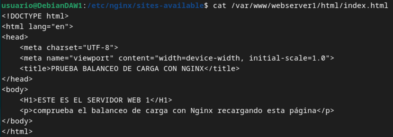
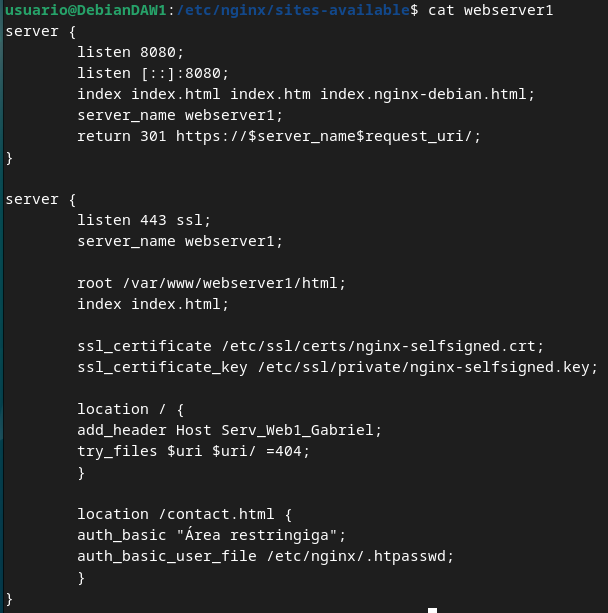
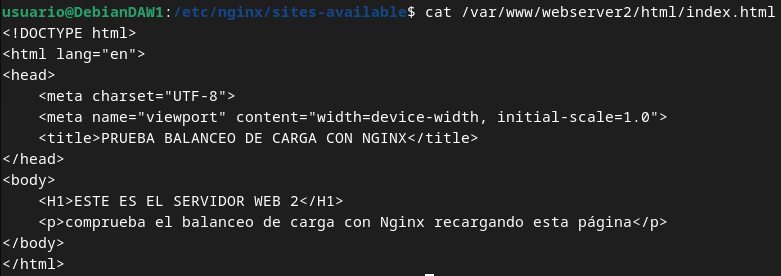
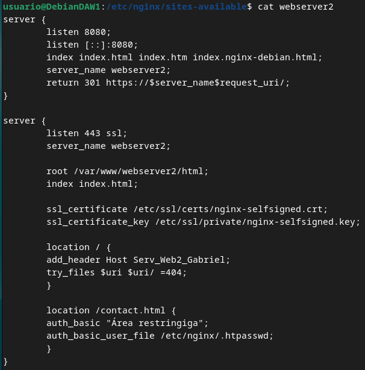
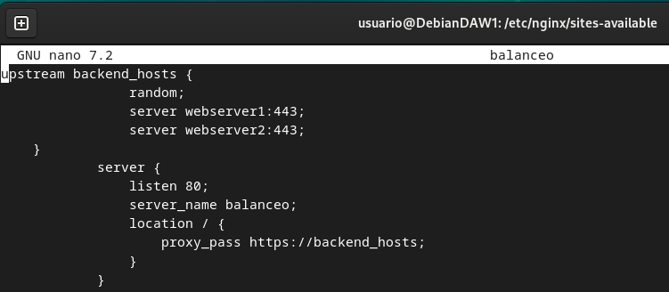
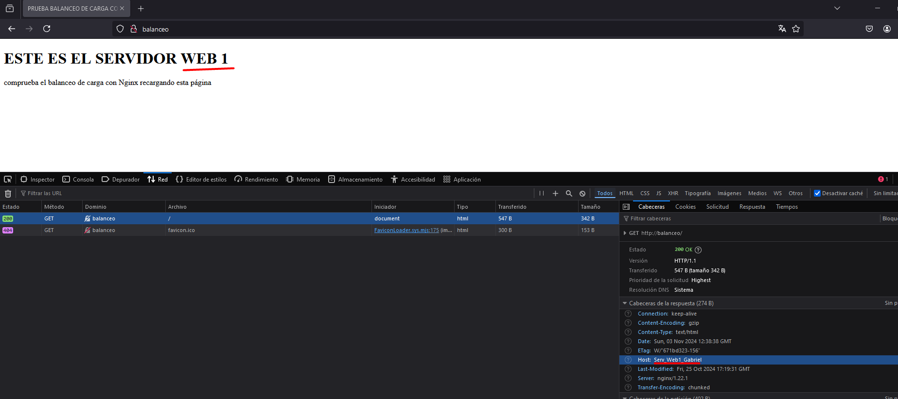
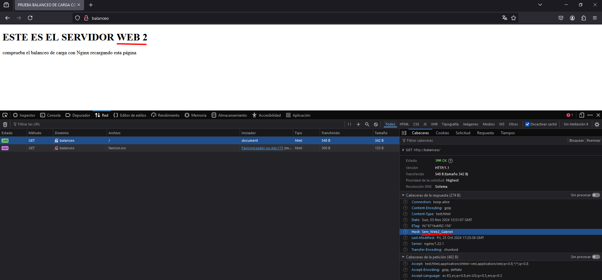

# Práctica 2.4 – Balanceo de carga con proxy inverso en Nginx
Vamos a configurar dos servidores web Nginx con dos máquinas Debian, además de reutilizar el proxy inverso Nginx configurado en la práctica anterior. Partiremos por tanto de la configuración de la práctica anterior, añadiendo lo necesario:

- Cada servidor web presentará un sitio web específico para esta práctica

 - El webserver2 debe tener la IP asignada de forma fija mediante la configuración DHCP.
- El proxy inverso que ya teníamos configurado, habrá ahora que configurarlo para que realice el balanceo de carga que deseamos

- Realizaremos las peticiones HTTP desde el navegador web de nuestra máquina anfitriona.

Haremos las peticiones web desde el navegador al proxy inverso, que las repartirá entre los dos servidores web que tenemos.

Accederemos a http://balanceo y debemos observar que las peticiones, efectivamente, se van repartiendo entre el servidor 1 y el 2.
### Configuraciones

#### Nginx Servidor Web 1
El primer servidor web será el servidor principal que hemos venido utilizando hasta ahora durante el curso, el original, donde tenemos instalado ya el servicio Web.

Debemos configurar este servidor web para que sirva el siguiente index.html que debéis crear dentro de la carpeta /var/www/webserver1/html:

- El nombre del sitio web que debéis utilizar en los archivos correspondientes (sites-available…) que debéis crear para Nginx es webserver1, así como en sus configuraciones. Fijáos en las configuraciones que hicisteis en prácticas anteriores a modo de referencia.

- El sitio web debe escuchar en el puerto 8080.

- Debéis añadir una cabecera que se llame Serv_Web1_vuestronombre.

#### Nginx Servidor Web 2
Debe ser una máquina Debian, clon del servidor web 1.

En este servidor web debemos realizar una configuración idéntica al servidor web 1 pero cambiando webserver1 por webserver2 (también en el index.html), así como el nombre de la cabecera añadida, que será Serv_Web2_vuestronombre

#### Nginx Proxy Inverso

Ya disponemos de los dos servidores web entre los que se van a repartir las peticiones que realice el cliente desde el navegador.

Vamos, por tanto, a configurar el proxy inverso para que realice este reparto de peticiones:

En sites-available debéis crear el archivo de configuración con el nombre balanceo
Este archivo tendrá el siguiente formato:

Donde:
El bloque upstream → son los servidores entre los que se va a repartir la carga, que son los dos que hemos configurado anteriormente.

Si miráis el diagrama y tenéis en cuenta la configuración que habéis hecho hasta ahora, aquí deberéis colocar la IP de cada servidor, así como el puerto donde está escuchando las peticiones web.

A este grupo de servidores le ponemos un nombre, que es backend_hosts

 #### Comprobaciones

