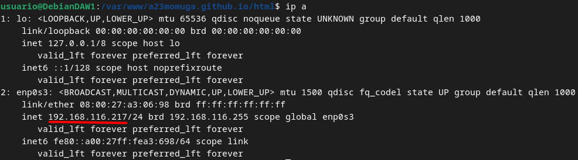
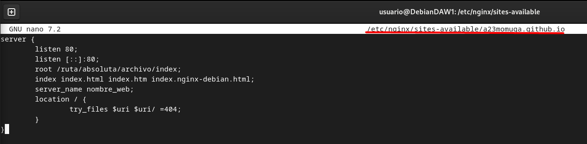

# Práctica 2.1 – Instalación y configuración de servidor web Nginx

## Instalación servidor web Nginx

Para instalar el servidor nginx en nuestra Debian, primero actualizamos los repositorios y después instalamos el paquete correspondiente:

Comprobamos que nginx se ha instalado y que está funcionando correctamente:

## Creación de las carpeta del sitio web
Todos los archivos que forman parte de un sitio web que servirá nginx se organizarán en carpetas. Estas carpetas, típicamente están dentro de ``/var/www ``

Así que, vamos a crear la carpeta de nuestro sitio web o dominio:

Dentro de esa carpeta html, debéis clonar el siguiente repositorio

Además, haremos que el propietario de esta carpeta y todo lo que haya dentro sea el usuario www-data, típicamente el usuario del servicio web.

Para comprobar que el servidor está funcionando y sirviendo páginas correctamente, podéis acceder desde vuestro cliente a con la dirección IP de la máquina virtual

## Configuración de servidor web NGINX
En ``/etc/nginx/sites-available/a23momuga.github.io`` insertamos el siguiente contenido

Y crearemos un archivo simbólico entre este archivo y el de sitios que están habilitados, para que se dé de alta automáticamente.

## Comprobaciones
Editamos el archivo ``/etc/hosts`` de nuestra máquina anfitriona para que asocie la IP de la máquina virtual, a nuestro ``server_name``.

Usando el siguiente comando podemos ver cada solicitud a su servidor web se registra en este archivo de registro

## Configurar servidor SFTP en Debian
En primer lugar, lo instalaremos desde los repositorios:

Ahora vamos a crear una carpeta en nuestro home en Debian:

Ahora vamos a crear los certificados de seguridad necesarios para aportar la capa de cifrado a nuestra conexión

Y una vez realizados estos pasos, procedemos a realizar la configuración de vsftpd propiamente dicha, buscaremos las siguientes líneas del archivo y las eliminaremos por completo

Tras ello, añadiremos estas líneas en su lugar

Y, tras guardar los cambios, reiniciamos el servicio para que coja la nueva configuración:

Y ya podremos usar ftp con el servidor nginx (Puerto 21 para ftp y Puerto 22 para sftp)

